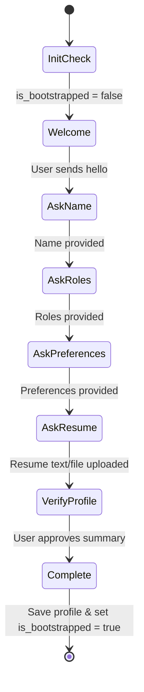

# Component Design: Backend Orchestrator & Containerized Agents

This document details the backend architecture for the **Career Pilot** system. It describes the orchestrator host, the agent container runtime, the IPC database schemas, and individual agent implementations.

---

## 1. Orchestrator Host Architecture

The host is a TypeScript Node.js service running continuously on the GCP Compute Engine VM. It performs three primary roles:
1. **Telegram Ingestion & Router**: Integrates with the Telegram Bot API (via long polling) to receive natural language instructions and route them using Gemini.
2. **Scheduler (Cron Daemon)**: Runs background checks (e.g. email/calendar sync, daily job hunting, and follow-up checking).
3. **Container Lifecycle Manager**: Spawns, monitors, and collects results from isolated Docker container agents.
4. **API Controller**: Exposes secure endpoints serving the recruiter portal frontend.

---

## 2. Container Isolation & File-Based IPC

To maintain security, agents run in temporary, isolated Docker containers and **do not** have direct write or read access to the host's primary SQLite database. Instead, they communicate via a **file-based JSON exchange** mounted on a shared docker volume `/shared`.

### The Lifecycle Loop
1. **Initiate**: The Host generates a unique `taskId` (UUID) and writes an input payload to `/shared/tasks/<taskId>.json`.
2. **Spawn**: The Host spawns the agent container using the Docker API (`dockerode`), mounting the `/shared` volume read-only for tasks and read-write only for results.
   ```bash
   docker run --rm \
     -v /home/app/shared/tasks/<taskId>.json:/input.json:ro \
     -v /home/app/shared/results:/results:rw \
     -e PORTKEY_API_KEY=$PORTKEY_API_KEY \
     career-pilot-agent-job-hunter
   ```
3. **Run**: The agent reads `/input.json`, executes its LLM and network scraping logic, writes a JSON output to `/results/<taskId>.json`, and exits.
4. **Collect**: The Host detects the container exit, reads `/shared/results/<taskId>.json`, processes and validates the contents, deletes the JSON files, and updates the SQLite DB.

---

## 3. Database Schema

The backend uses a local SQLite database (`backend/data/jobs.db`) with separate tables to guarantee data sanitation and support multi-user generic profiles.

```sql
-- Profile details of the candidate using the system (avoids hardcoding personal info)
CREATE TABLE candidate_profile (
    id INTEGER PRIMARY KEY AUTOINCREMENT,
    full_name TEXT NOT NULL,
    target_roles TEXT NOT NULL,         -- JSON array of strings: ["Sr. Software Engineer", "AI Lead"]
    location_preferences TEXT NOT NULL, -- JSON object: { "remote": true, "locations": ["Austin, TX"] }
    master_resume TEXT NOT NULL,        -- Markdown text of candidate's complete history
    domain_name TEXT NOT NULL           -- e.g. "hire.mydomain.com"
);

-- Core settings state (e.g., whether the bot onboarding is completed)
CREATE TABLE system_settings (
    key TEXT PRIMARY KEY,
    value TEXT NOT NULL
);

-- Private table containing sensitive, raw personal/application information
CREATE TABLE private_applications (
    id TEXT PRIMARY KEY,
    company_name TEXT NOT NULL,
    job_title TEXT NOT NULL,
    job_url TEXT,
    salary_range TEXT,
    contact_email TEXT,
    contact_name TEXT,
    status TEXT NOT NULL, -- DRAFT, TAILORED, APPLIED, INTERVIEWING, OFFER, REJECTED
    tailored_resume_path TEXT,
    applied_date TEXT,
    last_updated TEXT NOT NULL
);

-- Public table containing sanitized data for the recruiter portal
CREATE TABLE public_audit_trail (
    id TEXT PRIMARY KEY,
    timestamp TEXT NOT NULL,
    task_type TEXT NOT NULL, -- SCRAPING, RESUME_TAILORING, OUTREACH, INTERVIEW_PREP
    sanitized_summary TEXT NOT NULL,
    model_used TEXT NOT NULL,
    token_count INTEGER NOT NULL,
    logs_json TEXT NOT NULL -- Redacted execution steps
);

-- Google Workspace Sync State
CREATE TABLE sync_state (
    key TEXT PRIMARY KEY,
    val TEXT NOT NULL
);
```

### Anonymization & Sanitization Middleware
Before writing to `public_audit_trail`, the Host executes an obfuscation pipeline:
- **PII Stripping**: Employs regex engines to purge emails, phone numbers, and physical addresses.
- **Company Obfuscation**: Replaces actual target companies (stored in `private_applications`) with structural generalizations (e.g. *"A major financial technology platform"*, *"An early-stage AI medical startup"*).
- **Log Sanitation**: Scans agent stdout summaries with `google/gemini-3.5-flash` to filter out credential leaks or confidential details before committing to the public DB.

---

## 4. Recruiter Portal API Service

The Express app running on the host exposes specific APIs to fuel the frontend's gamified interface:

### A. `/api/funnel` (The Application Race Track)
Returns a sanitized list of active applications for display in the pipeline:
- **Response Format:**
  ```json
  [
    {
      "id": "app_01j48",
      "obfuscated_company": "A Series-B generative video startup",
      "job_title": "Senior Machine Learning Engineer",
      "status": "INTERVIEWING",
      "days_in_pipeline": 12,
      "confidence": 78
    }
  ]
  ```
- **Privacy Rule:** Real company names, salary specifications, and recruiter names are strictly withheld and swapped with generalized profiles.

### B. `/api/telemetry` (Operational Metrics)
Exposes agent metrics, model performance, and system health details:
```json
{
  "total_jobs_scraped": 842,
  "resumes_tailored": 28,
  "outreach_sent": 14,
  "cache_hit_rate": 82.5,
  "ollama_status": "ONLINE",
  "ollama_model": "llama3.2:3b",
  "system_status": "OPEN_FOR_OFFERS"
}
```

### C. `/api/simulate` (The Sandbox Playground)
Handles transient simulations submitted by visiting recruiters.
1. Receives input parameters: `companyName`, `jobTitle`, `jobDescription`.
2. Fetches the stored `master_resume` from the candidate profile database.
3. Spawns temporary instances of the **Resume Tailor** and **Cold Outreach** agents in sandbox mode.
4. Generates a custom CV tailoring suggestion and a draft outreach email in-memory.
5. **Security Isolation:** This transaction bypasses the database completely, saving no log history or application record. It serves strictly as a temporary UI response, validating Alexander's system design to recruiters dynamically.

---

## 5. Dynamic Telegram Onboarding (Natural Language Bootstrapping)

If `system_settings` indicates `is_bootstrapped` is not true, the Host enters onboarding mode. 

**Security Control**: To prevent unauthorized users from interacting with the bot and draining resources, the Host MUST validate the sender's Chat ID against the `ALLOWED_TELEGRAM_CHAT_ID` environment variable. Messages from any other ID are immediately dropped.

Every authorized message received via Telegram is routed to the onboarding state machine instead of the task runner:



### Conversational Onboarding Flow
1. **Welcome Alert**: If the SQLite database is uninitialized, the host sends:
   *"Hello! I am your AI job-hunting orchestrator. I notice your candidate profile is empty. Let's get set up! What is your full name?"*
2. **Name Processing**: The host saves the name and prompts:
   *"Nice to meet you! What target roles are you looking for? (e.g. 'Senior Software Engineer, AI Lead')"*
3. **Preferences Processing**: Saves target roles, then prompts:
   *"Understood. What are your location preferences? (e.g. 'Remote only', 'Hybrid in Austin, TX')"*
4. **Resume Ingestion**: Prompts:
   *"Perfect. Finally, please paste your complete master resume text here, or upload a markdown file. This will be used as the source of truth for all resume tailoring."*
5. **Summary & Completion**: Synthesizes the captured profile using Gemini, presents it to the user for natural-language confirmation. Once approved, the orchestrator:
   - Configures the database state (`is_bootstrapped = true`).
   - Begins the automated job-hunting sweeps.

All subsequent specialized agent containers fetch their parameters (candidate name, keywords, master resume) dynamically from the `candidate_profile` database table, keeping the codebase completely clean of hardcoded developer details.

---

## 6. Google Workspace Sync Setup

The synchronization loop relies on Google Workspace APIs configured in the GCP Project Console:
*   **Gmail Sync**: Uses the `gmail.readonly` scope. It polls for incoming emails containing terms like `interview`, `application received`, or `schedule your call` using Gmail's query language (`newer_than:1d`). Matches are parsed via LLM to extract interview dates and automatically shift the application status to `INTERVIEWING`.
*   **Calendar Sync**: Uses `calendar.events.readonly`. It monitors upcoming calendar invitations to trigger the **Interview Prep Agent** 24 hours prior to a scheduled call.

---

## 7. Specialized Agent Containers (NanoClaw Sandboxes)

To guarantee maximum security and operational independence, each specialized agent is built as a **NanoClaw Sandbox**—a minimal, audited Docker image containing only the NanoClaw runtime engine (~600 lines of TypeScript using the Claude SDK), target tools, and CA certificates.

### NanoClaw Agent Structure (`backend/agents/<agent-name>/`)
Every agent container is organized according to the NanoClaw minimalist directory pattern:
```text
backend/agents/<agent-name>/
├── src/
│   └── agent.ts             # Main NanoClaw agent loop (reads /input.json, runs loop, writes /results)
├── skills/                  # Core operational task scripts (tool executions)
│   ├── scrape-page.ts
│   └── tailor-diff.ts
├── CLAUDE.md                # Localized memory file (persona, task rules, and behavior constraints)
├── package.json
└── Dockerfile
```

### Key NanoClaw Concepts Used
1. **Localized Memory (`CLAUDE.md`):** Each agent features its own `CLAUDE.md` context file inside its container. This functions as the agent's memory bank, containing prompt specifications, persona directives, and task-specific rules (e.g., the `resume-tailor` agent's `CLAUDE.md` commands it to highlight only real metrics and avoid buzzwords).
2. **Modular Skills (`skills/`):** NanoClaw isolates actions into discrete skill scripts. The agent calls these skills dynamically. This ensures that the code remains highly readable, secure, and easily auditable by the user.
3. **Execution Sandbox:** The Host provisions these containers on the fly, mounting the shared volumes read-only for tasks (`/input.json`) and write-only for results (`/results/<taskId>.json`), strictly keeping the agent from tampering with the host database or operating system.

---

## 8. Local Developer vs. Cloud VM Docker Compose Configurations

To optimize costs and ensure reliability:
- **Local Dev Stack (`backend/docker-compose.yml`):** Runs the orchestrator host, the SQLite IPC volume, and a local GPU-accelerated **Ollama container** with WS2 NVIDIA pass-through. This allows the developer to test all pipelines and agents locally for $0 in token fees.
- **Production Cloud Stack (`backend/docker-compose.prod.yml`):** Deployed on the GCP `e2-small` VM. It excludes the `ollama` container to prevent CPU/memory exhaustion on the low-cost host. The VM host and containers route LLM requests exclusively to the Portkey API Gateway.
- **Cloud Tunnel Service:** In production, the compose stack launches a `cloudflared` container mapped to the Cloudflare Tunnel token, establishing secure outbound tunnels for the Express server.
